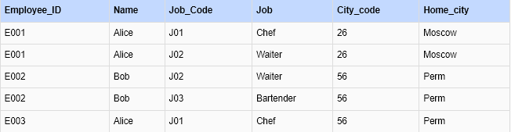
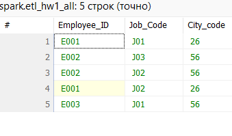
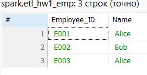
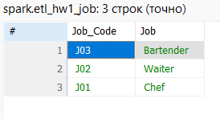
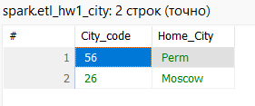

## Домашняя работа 1

### Задание 3
Определите в какой нормальной форме данная таблица, приведите её ко 2 и 3 нормальным формам последовательно.

Ответ. Первая нормальная форма, в каждой ячейке одно значение

