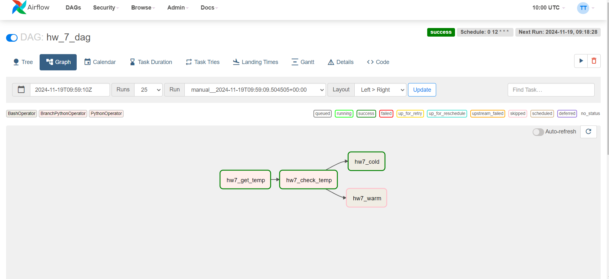
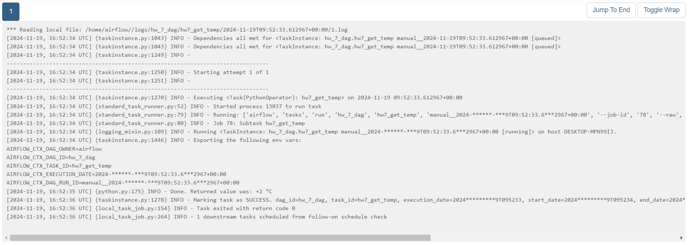
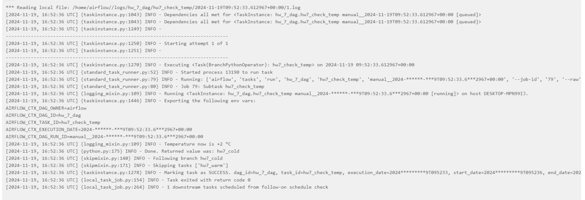
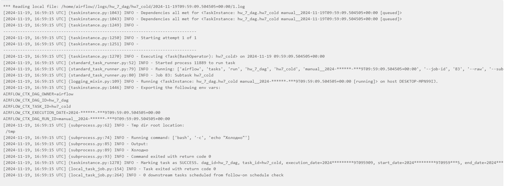

# Домашняя работа 7

— Зарегистрируйтесь в ОрепWeatherApi (https://openweathermap.org/api)
— Создайте ETL, который получает температуру в заданной вами локации, и
дальше делает ветвление:

• В случае, если температура больше 15 градусов цельсия — идёт на ветку, в которой есть оператор, выводящий на
экран «тепло»;
• В случае, если температура ниже 15 градусов, идёт на ветку с оператором, который выводит в консоль «холодно».

Оператор ветвления должен выводить в консоль полученную от АРI температуру.

— Приложите скриншот графа и логов работы оператора ветвленния.

https://cloud.mail.ru/public/s2Lz/7FrokxZuW
Ubuntu_2004.2021.825.0_x64.appx

Для просмотра MobaXterm

- WSL 3.8.10-0ubuntu1~20.04.12
- airflow 2.2.5
- sqlalchemy 1.3.34 (идет с airflow)
- pandas 1.3.5

sudo service mysql start
airflow scheduler & airflow webserver -p 8089

Сделаем загрузку с    
https://goweather.herokuapp.com/

не надо делать регистрацию

Run

log1

log2

log3

