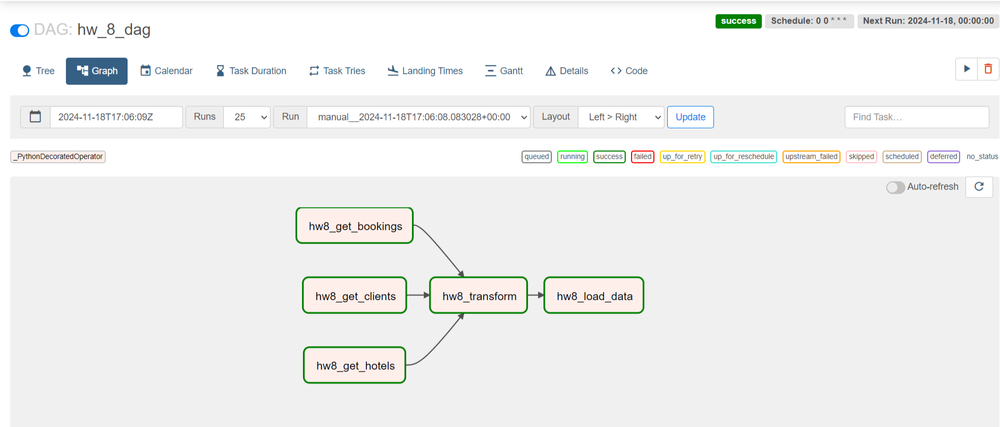
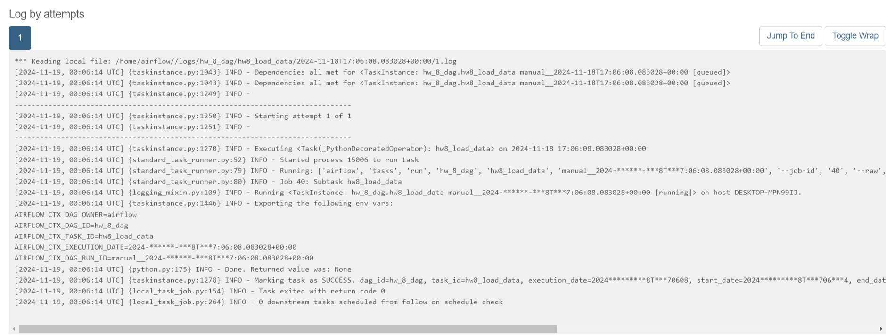
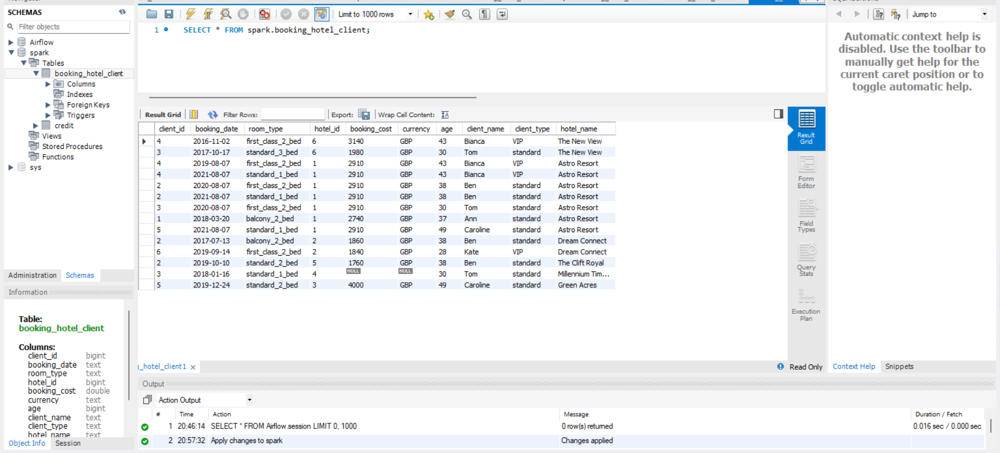

# Домашняя работа 8
1. Скачайте файлы boking.csv, client.csv и hotel.csv;
2. Создайте новый dag;
3. Создайте три оператора для получения данных и загрузите файлы. Передайте дата фреймы в оператор трансформации;
4. Создайте оператор который будет трансформировать данные:
— Объедините все таблицы в одну;
— Приведите даты к одному виду;
— Удалите невалидные колонки;
— Приведите все валюты к одной;
5. Создайте оператор загрузки в базу данных;
6. Запустите dag.

https://cloud.mail.ru/public/s2Lz/7FrokxZuW

Ubuntu_2004.2021.825.0_x64.appx

Для просмотра MobaXterm

- WSL 3.8.10-0ubuntu1~20.04.12
- airflow 2.2.5
- sqlalchemy 1.3.34 (идет с airflow)
- pandas 1.3.5

sudo service mysql start

airflow scheduler & airflow webserver -p 8089

Запуск

Журнал

Результат
