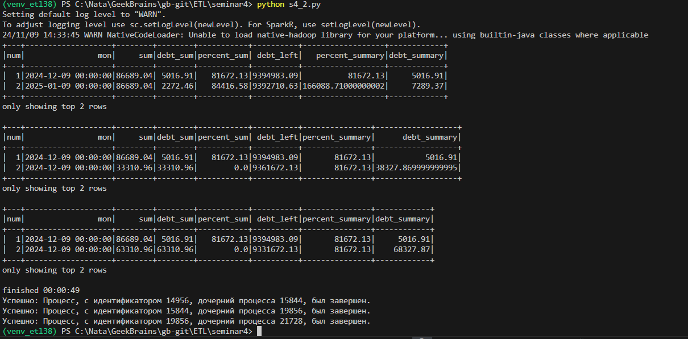
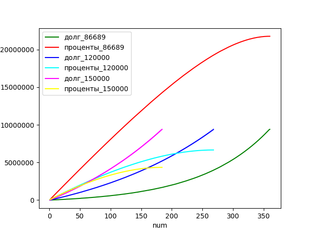

## Домашняя работа 4

За основу возьмите задание 4, решенное на семинаре.
В файле s4_2 параметры кредита: Займ 9400_000, срок 30 лет, ставка 10.6%

Через https://calcus.ru/kreditnyj-kalkulyator-s-dosrochnym-pogasheniem добавьте два листа excel с постоянным платежом 120 и 150 тыс. руб.

Добавьте графики с досрочным погашением по этим параметрам.
Т.е. линии основного долга и процентов если платеж будет 120 и 150 тыс. руб.
В результате должно получиться 6 линий. Используйте разные цвета.

Запуск

Результат

